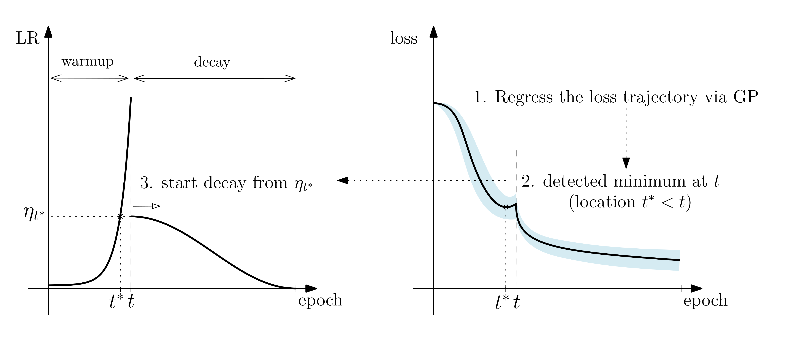

# Automated Learning Rate Scheduler for Large-Batch Training

The official repository for [Automated Learning Rate Scheduler for Large-Batch Training][1] (8th ICML Workshop on 
AutoML).

## Overview

AutoWU is an automated LR scheduler which consists of two phases: warmup and decay. Learning rate (LR) is increased 
in an exponential rate **until the loss starts to increase**, and in the decay phase LR is decreased following the 
pre-specified type of the decay (either cosine or constant-then-cosine, in our experiments).

Transition from the warmup to the decay phase is done automatically by testing whether the minimum of the predicted 
loss curve is attained in the past or not with high probability, and the prediction is made via Gaussian Process 
regression.




## How to use

### Setup

```shell
pip install -r requirements.txt
```

### Quick use

You can use `AutoWU` as other PyTorch schedulers, except that it takes `loss` as an argument (like 
`ReduceLROnPlateau` in PyTorch). The following code snippet demonstrates a typical usage of `AutoWU`.

```python
from autowu import AutoWU

...

scheduler = AutoWU(optimizer,
                   len(train_loader),  # the number of steps in one epoch 
                   total_epochs,  # total number of epochs
                   immediate_cooldown=True,
                   cooldown_type='cosine',
                   device=device)

...

for _ in range(total_epochs):
    for inputs, targets in train_loader:
        loss = loss_fn(model(inputs), targets)
        loss.backward()
        optimizer.step()
        optimizer.zero_grad()
        scheduler.step(loss)
```

The default decay phase schedule is ''cosine''. To use constant-then-cosine schedule rather than cosine, set 
`immediate_cooldown=False` and set `cooldown_fraction` to a desired value:
```python
scheduler = AutoWU(optimizer,
                   len(train_loader),  # the number of steps in one epoch 
                   total_epochs,  # total number of epochs
                   immediate_cooldown=False,
                   cooldown_type='cosine',
                   cooldown_fraction=0.2,  # fraction of cosine decay at the end
                   device=device)
```

## Reproduction of results

We provide an exemplar training script `train.py` which is based on [Pytorch Image Models][2]. The script supports 
training ResNet-50 and EfficientNet-B0 on ImageNet classification under the setting almost identical to the paper. 
We report the top-1 accuracy of ResNet-50 and EfficientNet-B0 on the validation set trained with batch sizes 4K 
(4096) and 16K (16384), along with the scores reported in our paper.


| ResNet-50 | This repo. | Reported (paper) |
|:---------:|:----------:|:----------------:|
| 4K        |  75.54%    |  75.70%          |
| 16K       |  74.87%    |  75.22%          |

| EfficientNet-B0 | This repo. | Reported (paper) |
|:---------------:|:----------:|:----------------:|
| 4K              |  75.74%    |  75.81%          |
| 16K             |  75.66%    |  75.44%          |


You can use `distributed.launch` util to run the script. For instance, in case of ResNet-50 training with batch 
size 4096, execute the following line with variables set according to your environment:
```shell
python -m torch.distributed.launch \
--nproc_per_node=4 \
--nnodes=4 \
--node_rank=$NODE_RANK \
--master_addr=$MASTER_ADDR \
--master_port=$MASTER_PORT \
train.py \
--data-root $DATA_ROOT \
--amp \
--batch-size 256 
```
In addition, add `--model efficientnet_b0` argument in case of EfficientNet-B0 training. 


## Citation

```bibtex
@inproceedings{
    kim2021automated,
    title={Automated Learning Rate Scheduler for Large-batch Training},
    author={Chiheon Kim and Saehoon Kim and Jongmin Kim and Donghoon Lee and Sungwoong Kim},
    booktitle={8th ICML Workshop on Automated Machine Learning (AutoML)},
    year={2021},
    url={https://openreview.net/forum?id=ljIl7KCNYZH}
}
```

## License

This project is licensed under the terms of Apache License 2.0.
Copyright 2021 Kakao Brain. All right reserved.


[1]: https://arxiv.org/abs/2107.05855
[2]: https://github.com/rwightman/pytorch-image-models
